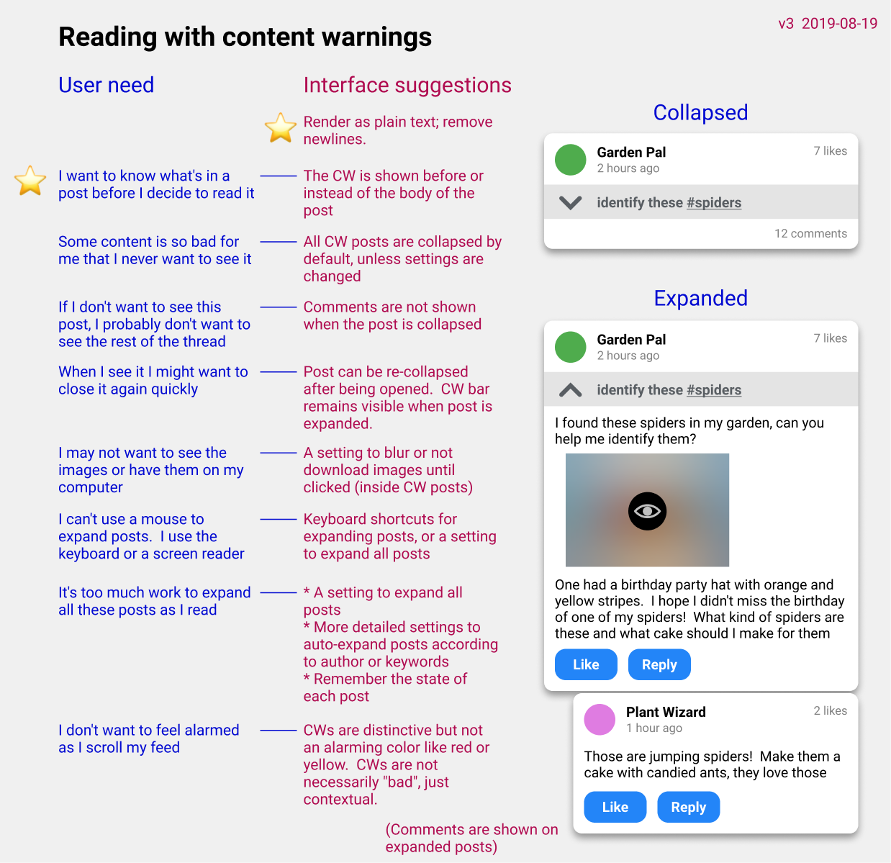

# SSB Content Warning spec

*v00.  2019-08-08*

## At a glance




## Why

People often want to avoid some topics in a conversation.

When speaking in real life you may ask listeners if they want to hear about a particular topic.  This is a way for speakers to show care for their audience.

This practice makes communication more consentful, upholding the "free listening" / "freedom of attention" aspect of the Scuttlebutt principles.

## What

A "content warning" is an optional author-provided field on a SSB message which describes, in human language, any content in the post which a reader may wish to avoid.

This enables readers to decide if they want to skip a post or read it, before they're exposed to the content itself.

Messages with no CW are unchanged by this specification.

## Social expectations

We assume the author is acting with care and goodwill towards others.  It is the author's responsibility to know their audience and be aware of topics that they are sensitive to.  This is a social norm which will emerge from an ongoing conversation between peers.  These norms will vary from community to community.

### Example use-cases

A short survey of Mastodon posts showed these content warnings (paraphrased).  This is not a normative list, just an example of use in the wild in one community.

* sexual content described in various ways, like “photo of butts”, “discussion of kink”
* discussion of racism
* discussion of transphobia
* discussion of various other difficult or triggering topics
* discussion of politics
* discussion of disturbing news of the day
* food
* eye contact
* flashing animation
* health problems
* asking for money
* death
* spoiler alert for a TV show or movie
* content that only some readers care about, like local events in a city
* identify this spider for me

On SSB perhaps people will #hashtag the important words to make auto-filtering easier.

## Ideas for user preferences

* Auto-expand or auto-collapse...
  * all CWs
  * CWs from these users: ___
  * CWs with these words or hashtags: ___

* Download images in CW posts...
  * in advance
  * when post is expanded
  * when image is clicked

* Blur images in CW posts

Users may wish to only download images from inside CW'd posts on demand, when they choose to expand the post.  This could be for legal, moral, or contextual reasons (e.g. the user is on a work computer).

Users may also wish to pre-fetch images in bulk so that they can go offline.  This conflicts with the previous wish.

## Privacy

Unless the user clearly indicates otherwise, their settings should not be stored as public messages in the user's feed.

Clients could allow users to export their settings, blocklists, and allowlists and share them with others.

## Accessibility

CWs add work to the process of reading because readers have to manually expand posts.  This amount of work may be an accessibility barrier.

Clients SHOULD accomodate keyboard-only users and screen-reader users.  Failing that, they SHOULD allow all posts to be expanded by default so that reading requires less interaction.

## Technical Specification

The content warning is a string in an optional JSON field, `contentWarning`.

```json
  {
    "key": "%xxxx.sha256",
    "value": {
      "previous": "%yyyy.sha256",
      "sequence": 123,
      "author": "@abcdefg.ed25519",
      "timestamp": 1565285000000,
      "hash": "sha256",
      "content": {
        "type": "post",

        "contentWarning": "identify these #spiders",
        ^^^^^^^^^^^^^^^^^^^^^^^^^^^^^^^^^^^^^^^^^^^^

        "text": "Can anyone help me identify these spiders? ",
        "mentions": [
          { "link": "#spiders" }
        ]
      },
      "signature": "zzzz.sig.ed25519"
    },
    "timestamp": 1565285000000
  },
```

## Future directions

We could use [Blurhash](https://blurha.sh) which converts images to very low resolution thumbnails stored as short text strings.  This would allow showing blurry images before downloading the actual image.  Mastodon does this; see [their blog post](https://blog.joinmastodon.org/2019/05/improving-support-for-adult-content-on-mastodon/).

We could let people place content warnings on other people's posts, but that's outside the scope of this document.  Care is required to avoid creating new vectors for abuse.

## FAQ

**- What if I don't want any client-side Javascript in my client?**

You can use the [details](https://developer.mozilla.org/en-US/docs/Web/HTML/Element/details) HTML element which allows expanding and collapsing a section of the DOM.

**- When a CW'd post has comments, should the entire thread be collapsed or only the first post?**

If the user doesn't want to read the post, they probably don't want to read the comments?

**- Why not use standardized or structured tags?**

The motivation for standardized tags is to help clients automatically show or hide certain classes of content.

The rich diversity of use-cases for content warnings, and the way they vary from community to community, makes it difficult to converge on a globally standard set of tags.  Therefore this document does not specify a standard set.

Showing the user something they don't want to see can be serious (emotionally painful, illegal, etc).  Without global standards, an automated show-or-hide feature will frequently fail and show users things they don't want to see, so it can't be relied on.  For that reason we default to hiding all posts and let the user decide about each one.

Locally standardized words will probably emerge in various communities.  Clients can autocomplete the content warning field with common words and hashtags observed in other content warning fields, to facilitate this convergence.

The primary goal, though, is human readbility.  People may want to auto-expand some words, but which content they feel like reading will vary from day to day according to their mood and emotional resources.

**- Why a new JSON field instead of embedding the warning inside the post text?**

For example, Livejournal used a special HTML tag `<lj-cut>spiders</lj-cut>`.  Reddit has its own syntax for spoilers, `>!spiders!<`.

Pros of that approach:
* Users can hide only certain parts of a post
* Probably visible in legacy clients which don't interpret the new markup

Cons:
* Adds more complexity to our already-customized Markdown parser, making it harder to implement SSB in new languages
* Users have to learn more markup instead of just typing into an additional field
* Users have to think more about which parts of their post to hide

Instead, the proposed approach is simpler to implement and simpler to use, though not quite as expressive.

**- How do I know what kind of content to tag?**

This is a social convention that emerges in conversations within a community.  Notice what topics other people are CW'ing.  Listen to your peers and act with care towards their experiences. 

You are not required to put content warnings on your posts.  Neither is anyone required to follow you.  The act of communication requires two consenting people.  Content warnings add more context and richness to this process of consent.
